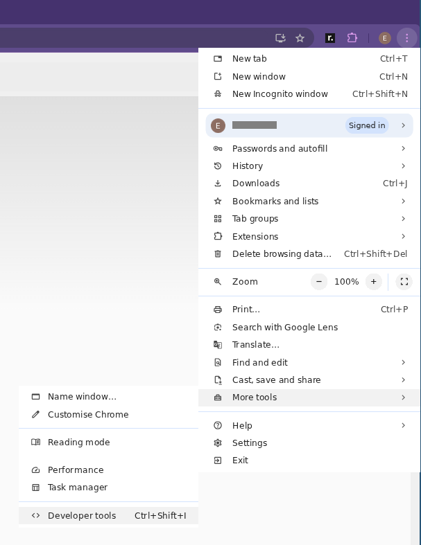
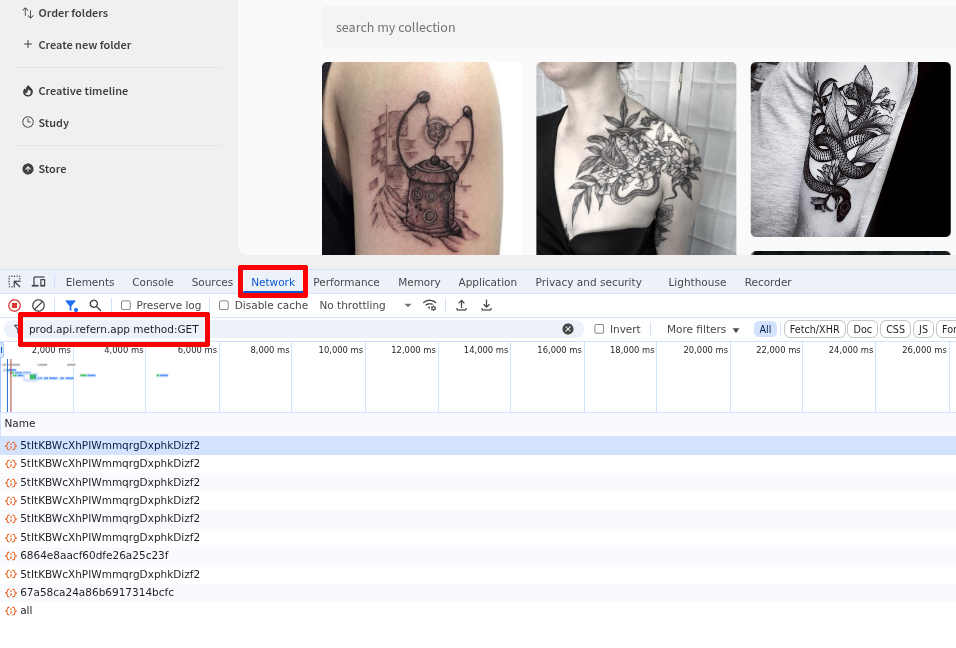
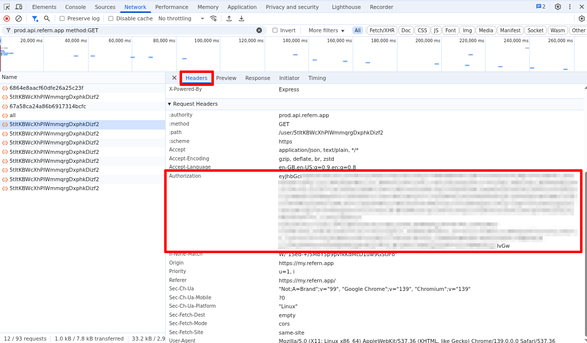

# refern-takeout

Unofficial tool for downloading a dump of all of your images, collections, boards and folders from refern.

## Installation

1. Install [Python][], if you haven't already.

   For Windows: https://www.python.org/ftp/python/3.13.7/python-3.13.7-amd64.exe

   For macOS: https://www.python.org/ftp/python/3.13.7/python-3.13.7-macos11.pkg

   For Linux: it's almost certainly pre-installed

2. [Download refern-takeout][] and extract the ZIP file on your computer.

## Using refern-takeout

1. Find your refern account username, beginning with `@`. This is usually displayed at the top right corner of the screen when logged into the app (on desktop).

2. Find your refern authorization token. Detailed steps below.

   **Treat your auth token the same way you'd treat your password. Anyone who possesses it has full access over your account.**

   a. Open [refern][refern-app] in your web browser, ensuring you're logged in.

   b. Open your browser's developer tools. On Google Chrome this can be found in the menu here:

      

   c. Select the Network tab, and copy/paste `prod.api.refern.app method:GET` into the filter box.

      

   d. Select any one of the items in the list below, and make sure the Headers tab is selected in the pane that appears.
      Your authorization token is the long string of text, likely beginning with "ey", appearing to the right of the word "Authorization".

      

   **Treat your auth token the same way you'd treat your password. Anyone who possesses it has full access over your account.**

3. In a shell/command line, run:

       python3 refern_takeout.py -u @yourusername

   where `@yourusername` is your username from step 1. When prompted for your authorization token, copy-paste it from where you found it in the developer tools in step 2.

4. Your refern content will be downloaded into a new folder named `refern`, located in the same folder as the `refern_takeout.py` script.

[Download refern-takeout]: https://TODO
[Python]: https://www.python.org/
[refern-app]: https://my.refern.app/
